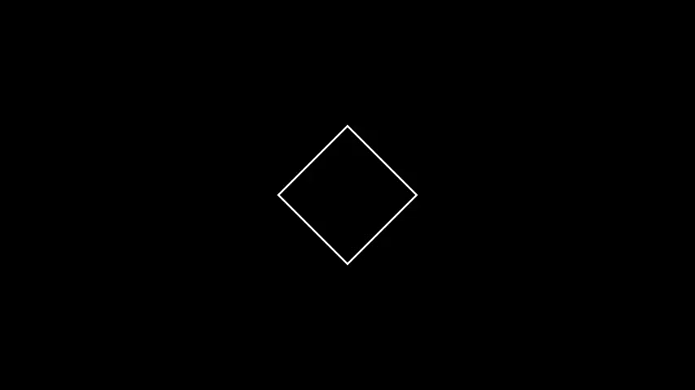
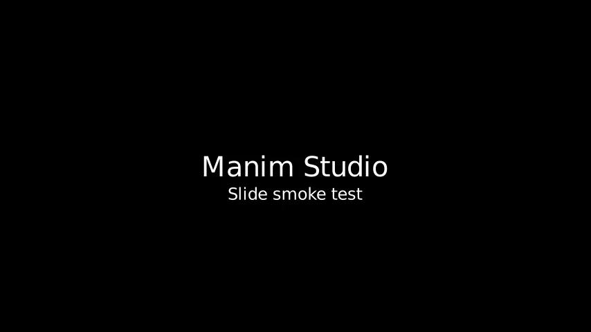

# Basic Scenes

The `examples` deck contains the smallest registered smoke scenes.

## SquareToCircle


Target:

```text
examples/square_to_circle
```

Source:

```text
examples/basic_scene.py
```

Class:

```text
SquareToCircle
```

Purpose: verify basic Manim Community rendering through Cairo.

Render:

```bash
studio render examples/square_to_circle --profile draft
```

Equivalent direct Manim command:

```bash
manim -ql examples/basic_scene.py SquareToCircle
```

## BasicSlide



Target:

```text
examples/basic_slide
```

Source:

```text
examples/basic_slide.py
```

Class:

```text
BasicSlide
```

Purpose: verify Manim Slides rendering and slide checkpoint output.

Render:

```bash
studio render examples/basic_slide --profile draft
```

Equivalent direct Manim Slides command:

```bash
manim-slides render -ql examples/basic_slide.py BasicSlide
```
